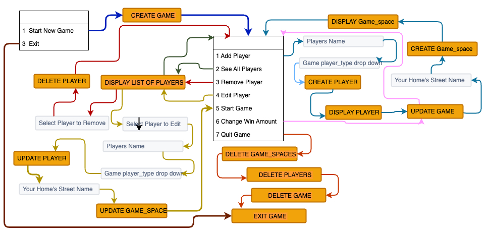

# MONOPOLYTHON

## Overview

- Monopolython is a command line interface application that is a smaller version of the commonly known Monopoly™ board game. This application is a meant to be a demonstration of how object relational mapping should be done using Sqlite3 and Python.

### Notable Mention:

The repository branch called helpertransfer contains all game play code and menus however time expired before I was able to debug effectively.  The issues appeared upon attempting to utilize helper files.  The main repository contains fully functional code for setting up a game which includes all crud requirements for all 3 classes. Code breaks at the point of starting the gameplay post setup.   

---

## Introduction

Monopoloython utilizes the command line interface(cli) as the access point for user interaction.  Unlike a graphical user interface (GUI), the CLI relies on text inputs and typically uses minimal graphics and sound as part of the user interation. As is typical of CLI applications, the use of the mouse is virtually absent.

This program relies upon a python interpreter and pip files to manage the virtual environment. Monopolython takes advantage of a handful of python libraries and modules to facilitate its functions. 

Monopolython relies heavily upon Sqlite3 for its database interfacing and management. Monopolython intendes to take advantage of the tools provided through the installed packages Rich and Pick to augment the graphical organization, presentation, and enhanced interactive features not found in native python libraries.  I have imported the python libraries:   time, os, random, ipdb, and sqlite3 as each offers tools that enable a more comfortable user experience. Primarily the libraries I've imported help manage the navigation of application menus in a way that makes them easier to read and assists in the speed at which information is presented to the user.


Take a look at the directory structure:

```console
.
├── Pipfile
├── Pipfile.lock
├── README.md
└── lib
    ├── models
    │   ├── __init__.py
    │   └── game.py
    │   └── game_space.py
    │   └── player.py
    │   └── space.py
    ├── cli.py
    ├── debug.py
    └── setup_helper.py
    └── monopolython.db
```


---

## Generating Your Environment

Upon installation of the program, users must first setup the virtual environment by running the
following commands:
```console
pipenv install
pipenv shell
```
### *** a migrate.py file exists to reinitiate the database and its tables if necessary ***
---

## Database Organization and Relationships

![Schema] (./lib/assets/Monopolython(3).png)
4 tables reside within the database to organize and store game data for both game_setup
and synchronous data storage and retrieval during game play.

.png>) 

This diagram dipicts the One to Many relationships between the Games tablem and both the Players and Game_spaces tables.   

The Spaces table is a unique table that is static. It is the root source of game information that exists for every game encounter. It has only a single boolean attribute that is updated during gameplay. giving it a one to many relationship with the games table but no others.

The CLI menus are intentionally designed to offer users a small number of options as they navigate their way through each menu, avoiding the cumbersome experience of over laden tables with excessive user options.  Starting with the game setup, the diagram below offers a roadmap of the flow of the program throughout the beginning of the game. This road map was created during inception and does not identically map to the game flow. I attempted to utilize an AGILE-like approach in creating this app meaning I was consistently checking functionality and subjectively measuring the user experience as the program was being built.




